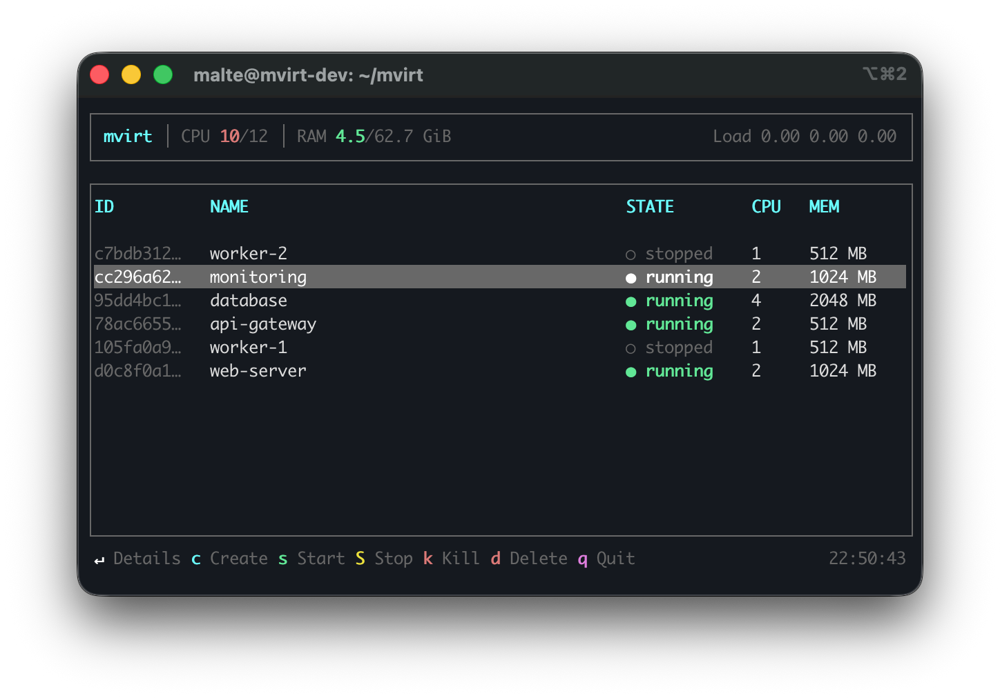

# mvirt

> [!WARNING]
> This project was vibe-coded with Claude Code. Not for production use!

Lightweight VM manager in Rust as a modern alternative to libvirt.



## Features

- **cloud-hypervisor** as hypervisor (instead of QEMU)
- **gRPC API** for easy integration
- **TUI** with ratatui
- **SQLite** for persistent state
- **Statically linked** with musl for easy deployment

## Architecture

```
┌─────────────────────────────────────────────────────────────┐
│                        mvirt (CLI/TUI)                      │
└───────┬─────────────┬─────────────┬─────────────┬───────────┘
        │             │             │             │ gRPC
        ▼             ▼             ▼             ▼
┌───────────┐  ┌───────────┐  ┌───────────┐  ┌───────────┐
│ mvirt-vmm │  │ mvirt-zfs │  │ mvirt-net │  │ mvirt-log │
│   :50051  │  │   :50053  │  │   :50054  │  │   :50052  │
└─────┬─────┘  └─────┬─────┘  └─────┬─────┘  └───────────┘
      │              │              │
      ▼              ▼              ▼
┌───────────┐  ┌───────────┐  ┌───────────┐
│ cloud-    │  │    ZFS    │  │   TAP     │
│ hypervisor│  │   Pool    │  │  Devices  │
└───────────┘  └───────────┘  └───────────┘
```

## Components

| Directory      | Port  | Description                          |
|----------------|-------|--------------------------------------|
| `mvirt-cli/`   | -     | CLI and TUI client                   |
| `mvirt-vmm/`   | 50051 | VM manager daemon                    |
| `mvirt-log/`   | 50052 | Centralized audit logging service    |
| `mvirt-zfs/`   | 50053 | ZFS storage management daemon        |
| `mvirt-net/`   | 50054 | Virtual networking daemon            |
| `mvirt-os/`    | -     | Linux kernel, initramfs, UKI builder |
| `proto/`       | -     | gRPC protocol definitions            |

## Prerequisites

```bash
# Rust with musl target
rustup target add x86_64-unknown-linux-musl

# Build tools
sudo apt install build-essential musl-tools

# For mvirt-os (Kernel/UKI)
sudo apt install flex bison libncurses-dev libssl-dev libelf-dev bc dwarves
sudo apt install systemd-ukify systemd-boot-efi genisoimage
```

## Build

```bash
# Build everything (Rust + Kernel + initramfs + UKI)
make

# Rust binaries only
make release

# mvirt-os only (kernel + initramfs + UKI)
make os

# Bootable ISO (BIOS + UEFI)
make iso

# Build in Docker (no local dependencies needed)
make docker

# Check build dependencies
make check
```

## Development

```bash
# Debug build
cargo build

# Start daemon (development)
cargo run --bin mvirt-vmm -- --data-dir ./tmp

# Start CLI/TUI
cargo run --bin mvirt

# Tests
cargo test --workspace

# Formatting & linting
cargo fmt && cargo clippy --workspace
```

## Directory Structure

```
mvirt/
├── Cargo.toml              # Workspace
├── Makefile                # Build orchestration
├── Dockerfile              # Build environment
├── proto/                  # gRPC protocol definitions
├── mvirt-cli/              # CLI + TUI
├── mvirt-vmm/              # VM manager daemon
├── mvirt-log/              # Audit logging service
├── mvirt-zfs/              # ZFS storage daemon
├── mvirt-net/              # Networking daemon
├── mvirt-os/               # Linux kernel + initramfs builder
│   └── pideisn/            # Rust init (PID 1)
├── docs/                   # Documentation
└── images/                 # VM disk images (not in git)
```

## Output

| File | Description |
|------|-------------|
| `target/x86_64-unknown-linux-musl/release/mvirt` | CLI binary |
| `target/x86_64-unknown-linux-musl/release/mvirt-vmm` | VM manager daemon |
| `target/x86_64-unknown-linux-musl/release/mvirt-log` | Logging service |
| `target/x86_64-unknown-linux-musl/release/mvirt-zfs` | ZFS storage daemon |
| `target/x86_64-unknown-linux-musl/release/mvirt-net` | Networking daemon |
| `mvirt-os/target/mvirt.efi` | Bootable UKI |
| `mvirt-os/target/mvirt-os.iso` | Bootable ISO |

## Documentation

- [Getting Started](docs/getting-started.md) - Quick start guide
- [Architecture](docs/architecture.md) - How components work together
- [Development Guide](docs/development/building.md) - Build system, workflow
- [Kernel Configuration](docs/development/kernel.md) - Kernel build, adding drivers
- [Networking](docs/concepts/networking.md) - vNICs, IP addressing, gateway model
- [Storage](docs/concepts/storage.md) - Templates, volumes, snapshots
- [Service Ports](docs/reference/ports.md) - All service ports and configuration

## License

Apache-2.0
