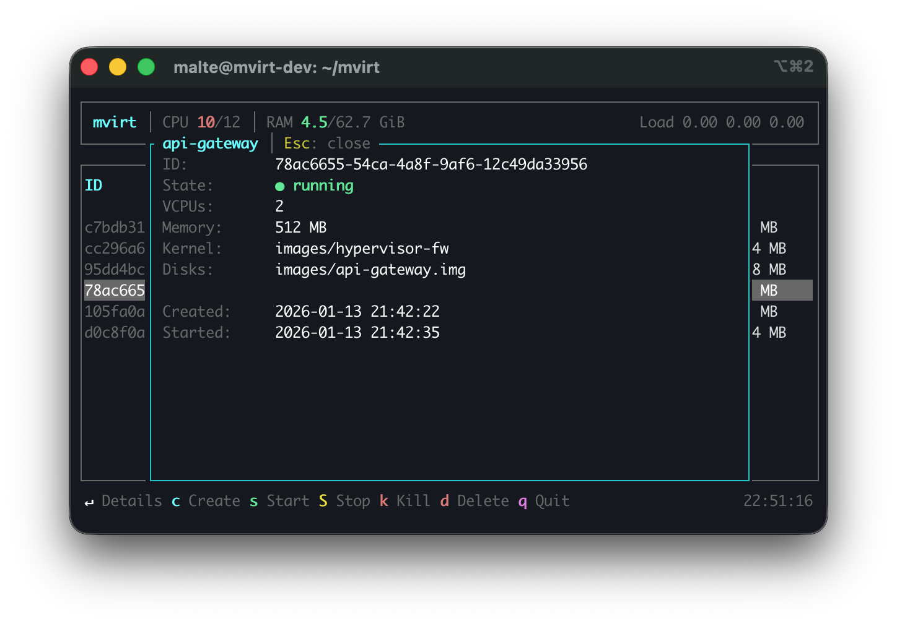

# mvirt-cli

CLI and TUI client for mvirt.

## Features

- **TUI** - Interactive interface with ratatui
- **CLI** - Scriptable commands
- **Console** - Serial console access (Ctrl+a t to exit)

## Usage

```bash
# Start TUI (default)
mvirt

# CLI commands
mvirt list
mvirt create --name test --kernel /path/to/kernel --disk /path/to/disk.raw
mvirt start <id>
mvirt stop <id>
mvirt console <id>
```

## TUI




### Keyboard Shortcuts

| Key | Action |
|-----|--------|
| `↵` | Show VM details |
| `c` | Create new VM |
| `s` | Start VM |
| `S` | Stop VM (graceful) |
| `k` | Kill VM (force) |
| `d` | Delete VM |
| `q` | Quit |
| `↑/↓` | Navigation |

### Create Modal

- **Name** - Optional, only `[a-zA-Z0-9-_]`
- **Kernel** - Required, file picker with Enter
- **Disk** - Required, file picker with Enter
- **VCPUs** - Default 1, numbers only
- **Memory** - Default 512 MB, numbers only
- **User-Data** - Optional, cloud-init YAML

## CLI Commands

### Create VM

```bash
mvirt create \
    --name myvm \
    --kernel /path/to/vmlinux \
    --disk /path/to/disk.raw \
    --vcpus 2 \
    --memory 1024 \
    --user-data /path/to/cloud-init.yaml
```

### Manage VMs

```bash
mvirt list                  # List all VMs
mvirt get <id>              # VM details
mvirt start <id>            # Start VM
mvirt stop <id>             # Graceful shutdown (30s timeout)
mvirt stop <id> -t 60       # With 60s timeout
mvirt kill <id>             # Force kill
mvirt delete <id>           # Delete VM (must be stopped)
```

### Console

```bash
mvirt console <id>          # Connect to serial console
                            # Ctrl+a t to exit
```

## Options

| Option | Default | Description |
|--------|---------|-------------|
| `-s, --server` | `http://[::1]:50051` | gRPC server address |

## Exit Codes

| Code | Meaning |
|------|---------|
| 0 | Success |
| 1 | Error (connection, API, etc.) |
